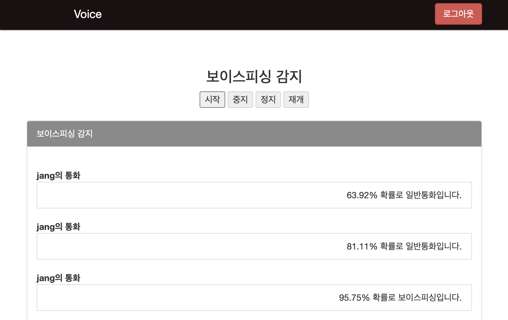

# Django Speech to text, Voise Phishing detecter
실시간으로 STT를 하여 KOBERT, BILSTM 모델을 사용하여 보이스피싱인지 유무 검출

# Commands to Setup the environment and run the server

> git clone https://github.com/urinaner/voice_phishing.git

> cd Django-Speech-to-text-Chat

> virtualenv venv

> source venv/bin/activate

> pip install -r requirements.txt

> python manage.py runserver

 

 

